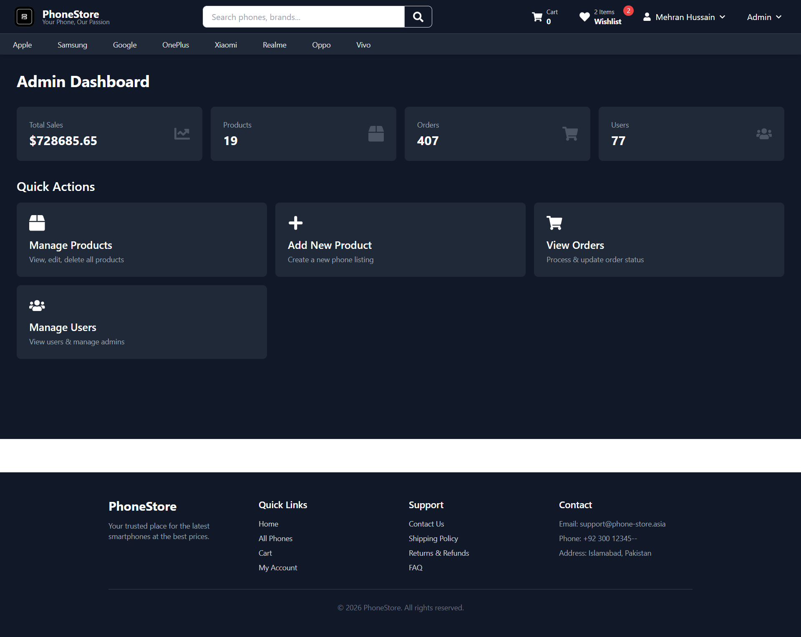
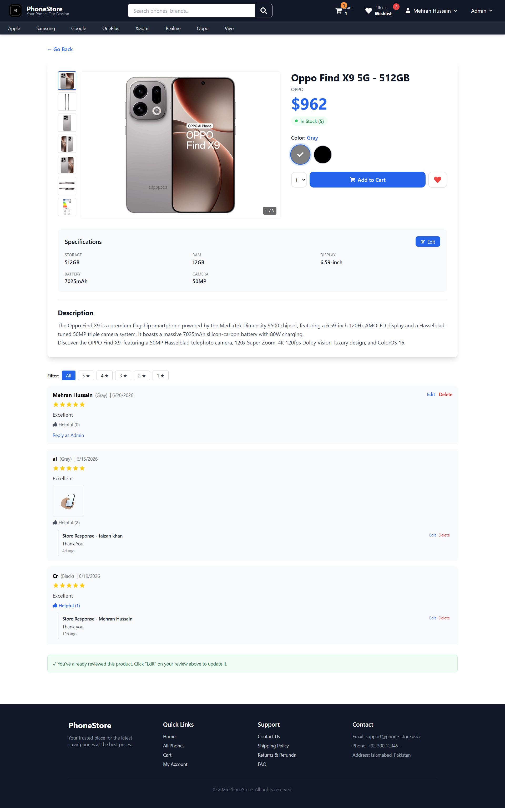
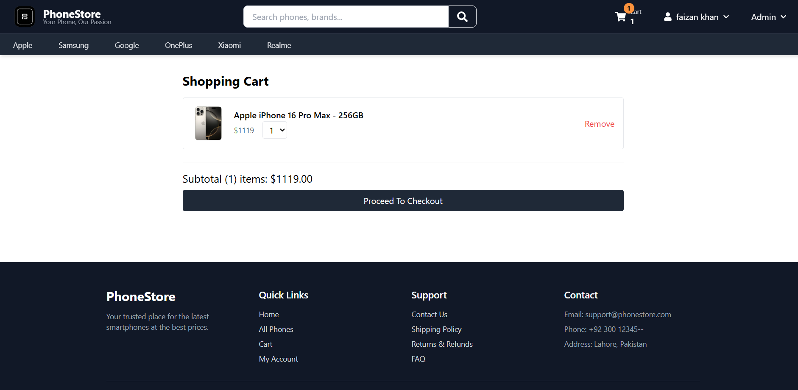
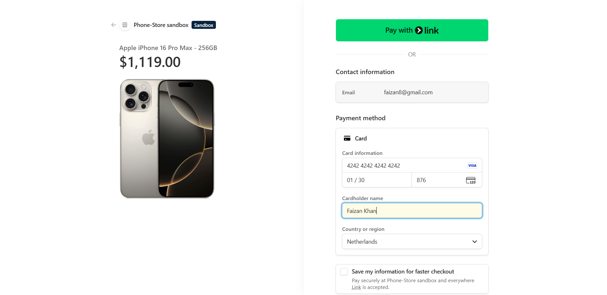
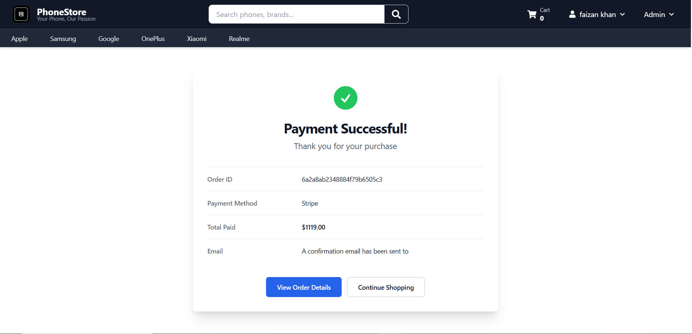
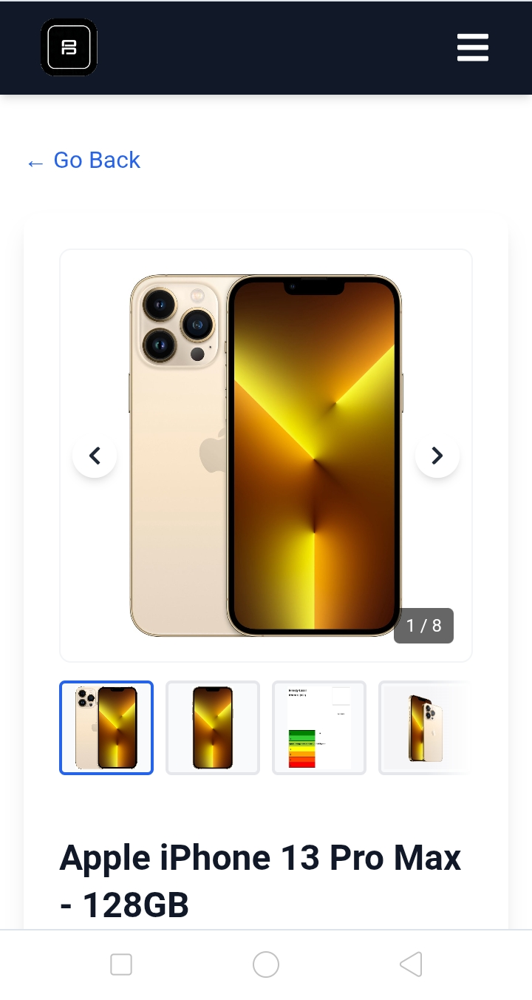
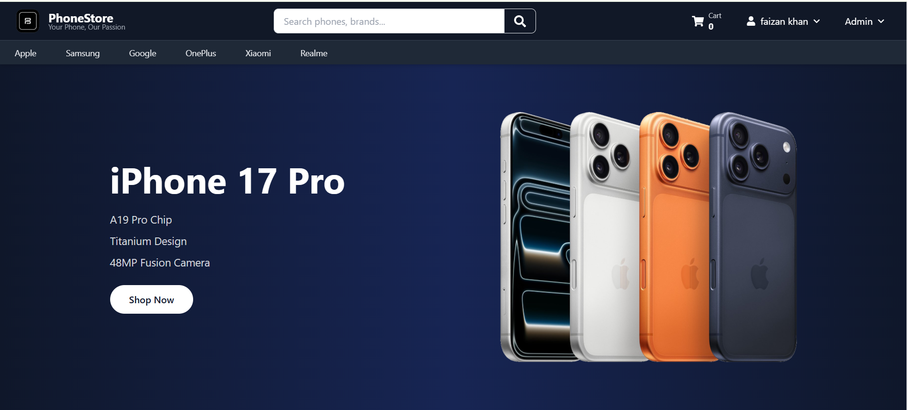

# Phone-Store - Full Stack MERN E-commerce Platform

**Live Demo:** https://www.phone-store.asia

**Live Demo Backup:** https://phone-shop-front-end-woad.vercel.app  

**Demo Admin:** demo@phonestore.com / demo123 - Read-only access

## Tech Stack
**Frontend:** React 18, Vite, Tailwind CSS, Redux Toolkit, React Router  
**Backend:** Node.js, Express, MongoDB, Mongoose  
**Auth & Features:** JWT, bcrypt, Cloudinary for image storage, Stripe Test Mode for payments

## Key Features
- Full product CRUD with Cloudinary image upload
- Admin dashboard with sales analytics and order management
- Role-based authentication: Admin vs Customer accounts
- Shopping cart with Redux Toolkit + localStorage persistence  
- Stripe payment integration - currently in test mode
- Order history and status tracking
- Fully responsive design for mobile/desktop

## Screenshots
   
### Admin Dashboard - Sales Analytics & Order Management


### Product Catalog & Detail Page


### Shopping Cart


### Stripe Payment Integration


### Payment Successful Page


### Mobile Responsive Design


### Home Page Banner



**Note:** Payment is in Stripe test mode. Use card `4242 4242 4242 4242` to test checkout.

## Run Locally

### 1. Clone the repo
```bash
git clone https://github.com/Mehran096/phoneshop.git
cd phoneshop
